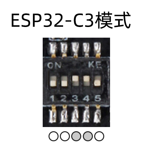
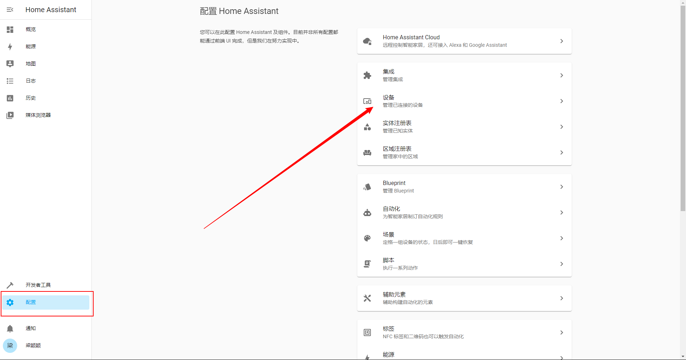
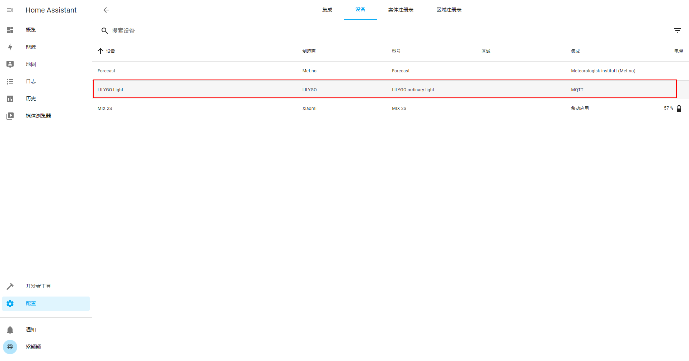
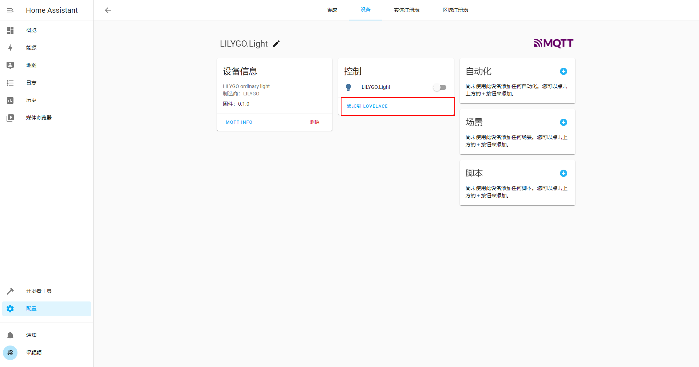
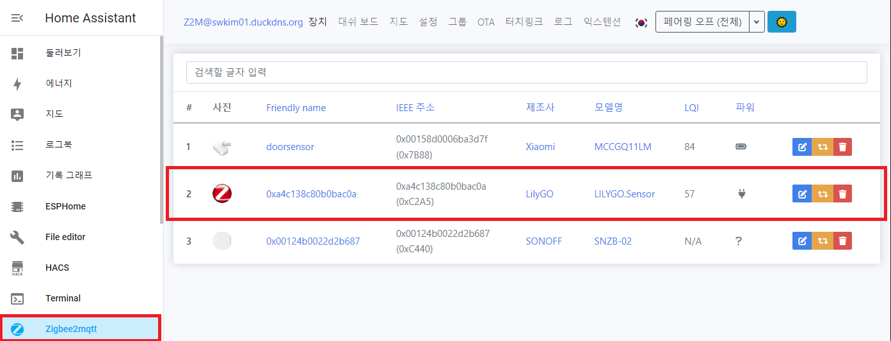

# Sensor Demo

A zigbee router device. esp32-c3 controls zigbee behavior via zbhci.

## Hardware Required

- One T-ZigBee board (device) and Other Zigbee coordinator (T-Zigbee board or USB Type Zigbee Coordinator)
- U2T

## Software Required

- Install [mosquitto](https://zbhci.readthedocs.io/en/latest/user-guide/mosquitto.html)
- Install [home assistant](https://zbhci.readthedocs.io/en/latest/user-guide/home-assistant.html)
- Install [Zigbee2MQTT Addon](https://github.com/zigbee2mqtt/hassio-zigbee2mqtt) in case of USB Type Zigbee Coordinator.

## zigbee2mqtt

### Case 1 : T-Zigbee board as coordinator

Select one of the T-ZigBee as the zigbee gateway, and program the program [zigbee2mqtt](../zigbee2mqtt). And follow the [documentation](https://zbhci.readthedocs.io/en/latest/user-guide/zigbee2mqtt.html) for related configuration.

### Case 2 : USB type coordinator such as Sonoff Zigbee 3.0 USB Dongle plus etc.

If you are running Home Assistant OS or a Supervised Home Assistant instance the easiest way to install Zigbee2MQTT is via the addon. Instructions on how to install it can be found [here](https://github.com/zigbee2mqtt/hassio-zigbee2mqtt#installation).

## sensor_demo

Select T-ZigBee as the node. Do the following.

### Make hardware

Connect the T-Zigbee board with a dht11/dht22 sensor as follows.

### Update Firmware

Adjust the DIP switch:

Need to upgrade the firmware of TLSR8258 to [hciDevice_ZR_8258_SDK_eb644f1_MD5_3e7c395bacca28475952808a79ff2ec1.bin](../../firmware/hciDevice_ZR_8258_SDK_eb644f1_MD5_3e7c395bacca28475952808a79ff2ec1.bin)

### Upload Sketch

Adjust the DIP switch:

Upload the [sensor_demo.ino](./sensor_demo.ino) sketch

## Pair

### Case 1 : T-Zigbee board as coordinator

1. Double-click the button on the upper side of the gateway to open the device join mode. Open successfully. The green led will be constant.

    

2. Press and hold the button on the top of the node device for 3 seconds to start pairing. The green led will be constant, indicating that the pairing is complete.

    

### Case 2 : USB type coordinator such as Sonoff Zigbee 3.0 USB Dongle plus etc.

Zigbee2MQTT addon has a built-in webbased frontend. You can pair the device by clicking permit join button on the web before above pairing action on the board.
    

## Home Assistant

### Case 1 : T-Zigbee board as coordinator

### Case 2 : USB type coordinator such as Sonoff Zigbee 3.0 USB Dongle plus etc.

Add this external converter [lilygo_sensor.js](./lilygo_sensor.js) to Zigbee2MQTT config directory as to [this procedure](https://www.zigbee2mqtt.io/advanced/support-new-devices/01_support_new_devices.html#instructions) and then join the device.
You can show the device on the sumenus of Zigbee2MQTT.

